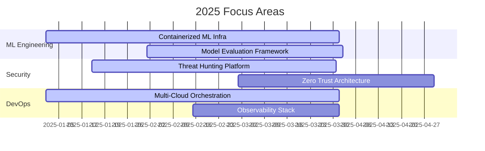
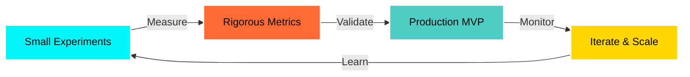

<div align="center">

<!-- ANIMATED HEADER -->


<!-- ANIMATED TYPING -->
<a href="https://git.io/typing-svg"></a>

</div>

---

<div align="center">

### **CORE DOMAINS**

<table>
<tr>
<td align="center" width="33%">

**🧠 APPLIED AI/ML**
```yaml
Focus: Production ML Systems
├─ Model Training & Optimization
├─ MLOps & Experiment Tracking
├─ Real-time Inference Pipelines
└─ Adversarial Robustness
```

</td>
<td align="center" width="33%">

**🛡️ BLUE TEAM SECURITY**
```yaml
Focus: Defensive Security Ops
├─ Threat Detection & Response
├─ Security Monitoring (SIEM)
├─ Incident Response Automation
└─ Threat Intelligence
```

</td>
<td align="center" width="33%">

**⚙️ DEVOPS & INFRA**
```yaml
Focus: Cloud-Native Engineering
├─ Container Orchestration (K8s)
├─ CI/CD Pipeline Automation
├─ Infrastructure as Code
└─ Observability & Monitoring
```

</td>
</tr>
</table>

</div>

---

## **🎯 CURRENT OBJECTIVES**

<div align="center">



</div>

> **Primary Mission:** Ship production-grade ML infrastructure with security-first principles and full observability

- ✅ **ML Infrastructure** → Docker/K8s-based training pipelines with experiment tracking
- ✅ **Security Hardening** → Automated threat detection with SOAR integration
- ✅ **DevOps Acceleration** → GitOps workflows with sub-5min deployment cycles
- 🔄 **Public Research** → Reproducible experiments with documented trade-offs

---

## **💻 TECHNICAL ARSENAL**

<div align="center">

### **Languages & Frameworks**


### 🤖 AI & Machine Learning


### 🔐 Security & Reverse Engineering


### ☁️ DevOps & Infrastructure


### 🌐 Web Development


### 🗄️ Databases & Storage


</div>

---

## **🏆 PRODUCTION HIGHLIGHTS**

<div align="center">

```ascii
╔══════════════════════════════════════════════════════════════════════════════╗
║                         BATTLE-TESTED DEPLOYMENTS                            ║
╚══════════════════════════════════════════════════════════════════════════════╝
```

</div>

### **🤖 Production ML Pipeline**
```python
Impact: Deployment time reduced from WEEKS → HOURS
```
- Architected end-to-end ML training system with automated hyperparameter tuning
- Implemented CI/CD for model versioning, testing, and canary deployments
- Built experiment tracking with MLflow + distributed training on Ray clusters
- **Stack:** PyTorch, Kubernetes, Argo Workflows, MLflow, Ray, FastAPI

---

### **🛡️ Automated Threat Detection Platform**
```bash
Scale: Processing 500K+ events/sec with <2s detection latency
```
- Designed real-time threat detection using Elastic Stack + custom ML models
- Integrated SOAR playbooks for automated incident response (90% auto-remediation)
- Built threat intelligence pipeline aggregating 15+ feeds into unified data lake
- **Stack:** Elasticsearch, Logstash, Kibana, Python, Suricata, MISP, TheHive

---

### **⚙️ Multi-Cloud Infrastructure Orchestrator**
```yaml
Achievement: 99.97% uptime across hybrid cloud deployments
```
- Implemented GitOps-driven infrastructure with declarative K8s manifests
- Built self-healing clusters with auto-scaling based on custom metrics
- Deployed observability stack with distributed tracing and SLO monitoring
- **Stack:** Kubernetes, Terraform, ArgoCD, Prometheus, Grafana, Jaeger

---

### **🔒 Adversarial ML Evaluation Framework**
```python
Coverage: Testing against 50+ attack vectors (FGSM, PGD, C&W, etc.)
```
- Developed automated adversarial testing harness for model robustness validation
- Implemented model hardening techniques (adversarial training, certified defenses)
- Built audit trail system for regulatory compliance and explainability
- **Stack:** TorchAttacks, CleverHans, ART, SHAP, LIME

---

### **📊 Real-time System Observability Platform**
```bash
Monitoring: 200+ microservices across 5 production clusters
```
- Designed SLO-driven alerting with intelligent noise reduction (80% fewer false positives)
- Implemented distributed tracing for root cause analysis of complex failures
- Built cost attribution system for multi-tenant resource optimization
- **Stack:** Prometheus, Grafana, Loki, Tempo, OpenTelemetry, Thanos

---

## **📈 GITHUB ANALYTICS**

<div align="center">


<!-- Contribution Snake Animation -->


<!-- Trophy Stats -->


</div>

---

## **🧪 ENGINEERING PHILOSOPHY**

<div align="center">



</div>

### **Core Principles**

```yaml
Development_Methodology:
  - Small_Iterations: "Prototype → Metric → Ship minimal reliable surface"
  - Automation_First: "If you do it twice, automate it"
  - Observability: "You can't improve what you don't measure"
  - Security_by_Design: "Threat modeling before first line of code"
  - Documentation: "Code is read 10x more than written"

Technical_Standards:
  - Testing: "Unit → Integration → E2E with >80% coverage"
  - Performance: "P95 latency < 100ms for critical paths"
  - Reliability: "Design for failure, embrace chaos engineering"
  - Scalability: "Horizontal scaling + stateless where possible"
  - Maintainability: "DRY principles + comprehensive logging"
```

---

## **🔬 ACTIVE RESEARCH**

<div align="center">

| **Domain** | **Focus Area** | **Status** |
|:-----------|:---------------|:-----------|
| **ML Ops** | Federated Learning at Scale | 🟢 In Progress |
| **Security** | ML-based Anomaly Detection for APTs | 🟢 In Progress |
| **DevOps** | eBPF for Container Security Monitoring | 🟡 Research |
| **AI Safety** | Adversarial Defense Mechanisms | 🟢 In Progress |
| **Infrastructure** | Service Mesh Observability Patterns | 🟡 Research |

</div>

---

## **📚 SELECTED PROJECTS**

<div align="center">

<a href="https://github.com/ininsico/ghost-cloud">
  
</a>

<a href="https://github.com/ininsico/ml-security-toolkit">
  
</a>

<a href="https://github.com/ininsico/k8s-sre-toolkit">
  
</a>

<a href="https://github.com/ininsico/threat-hunting-framework">
  
</a>

</div>

---

## **📡 CONNECT & COLLABORATE**

<div align="center">

[](https://github.com/ininsico)
[](https://twitter.com/ininsico)
[](https://linkedin.com/in/ArslanRathore)
[](mailto:ininsico@gmail.com)

### **Open to:**
```bash
✓ Production ML system design & implementation
✓ Security architecture & threat modeling
✓ DevOps/SRE consulting & infrastructure audits
✓ Open-source collaboration on impactful projects
✓ Technical writing & knowledge sharing
```

</div>

---

<div align="center">

<!-- Visitor Counter -->


<!-- Animated Footer -->


---

**Built with 🔥 by [@ininsico](https://github.com/ininsico) | Last updated: 2025**

<sub>⚡ Powered by GitHub Stats API, Shields.io, Capsule Render, and custom SVG animations</sub>

</div>
